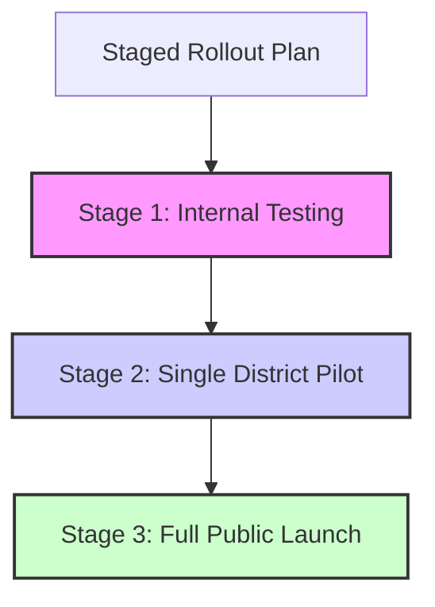

# Go-Live Checklist

This checklist tracks the steps required to transition the Vigour Seeds WhatsApp platform from staging/testing to production.

## 1. Meta Setup & Approvals
- [ ] **Meta App Review & Permissions**
  - Verify that `whatsapp_business_messaging` and `whatsapp_business_management` permissions are approved.
  - Complete Business Verification in Meta Business Manager.
- [ ] **Phone Number & Display Name**
  - Verify the production phone number is registered on WhatsApp Business Platform.
  - Confirm that the Display Name has been approved and complies with WhatsApp guidelines.
- [ ] **Template Approval**
  - Ensure all nurture/follow-up utility templates (e.g. `distributor_nurture_day1`, `farmer_followup_day3`) are submitted and approved in the Meta App Dashboard.
  - Match placeholder parameters (`{{1}}`, `{{2}}`) precisely to the codebase structure.

## 2. Infrastructure & Environment Variables (Render)
- [ ] **Required Env Vars**
  - [ ] `META_VERIFY_TOKEN`: Set to the webhook subscription validation token.
  - [ ] `META_WHATSAPP_TOKEN`: Permanent System User access token with messaging permissions.
  - [ ] `META_PHONE_NUMBER_ID`: Production phone number ID.
  - [ ] `META_APP_SECRET`: App secret for signing validation.
  - [ ] `SUPABASE_URL` / `SUPABASE_SERVICE_KEY`: Production Supabase client credentials.
  - [ ] `AI_PROVIDER`: Set to `gemini` (or fallback provider).
  - [ ] `GEMINI_API_KEY`: Production Gemini API key.
  - [ ] `APP_ENV`: Set to `production`.
  - [ ] `ALERT_CHANNEL`: Set to `webhook` (Slack/Teams Integration).
  - [ ] `ALERT_WEBHOOK_URL`: Configured destination webhook.
  - [ ] `PUSH_METRICS_TO_DB`: Set to `true` to persist hourly metric rollups.

## 3. Database & Security (Supabase)
- [ ] **Row Level Security (RLS)**
  - Ensure RLS is enabled on all tables: `leads_farmer`, `leads_distributor`, `conversations`, `sessions`, `tickets`, `recommendation_rules`.
  - Configure policies so that only authorized server actions (using the Service Role Key) can write/read data.
- [ ] **Indexes & Performance**
  - Verify indexes exist on search filters:
    - `leads_farmer`: `crop`, `crop_category`, `whatsapp_phone`.
    - `conversations`: `whatsapp_phone`, `direction`, `created_at`.
- [ ] **Backups**
  - Schedule daily automated logical backups of the Supabase PostgreSQL database.

## 4. Staged Rollout Plan
To minimize risk and monitor system performance, rollout follows these stages:

* **Stage 1: Internal Testing**
  * Target: Internal team members and QA staff (5-10 numbers).
  * Focus: End-to-end messaging flow validation, error fallback testing, load limits.
* **Stage 2: Single District Pilot**
  * Target: Gunna district (Madhya Pradesh) (~100 qualified farmers/distributors).
  * Focus: Quality of recommendations, response times, human escalation responsiveness.
* **Stage 3: Full Public Launch**
  * Target: Open public access across all configured states/districts.
  * Focus: Monitoring circuit breakers, API rate limits, and daily token spend.
